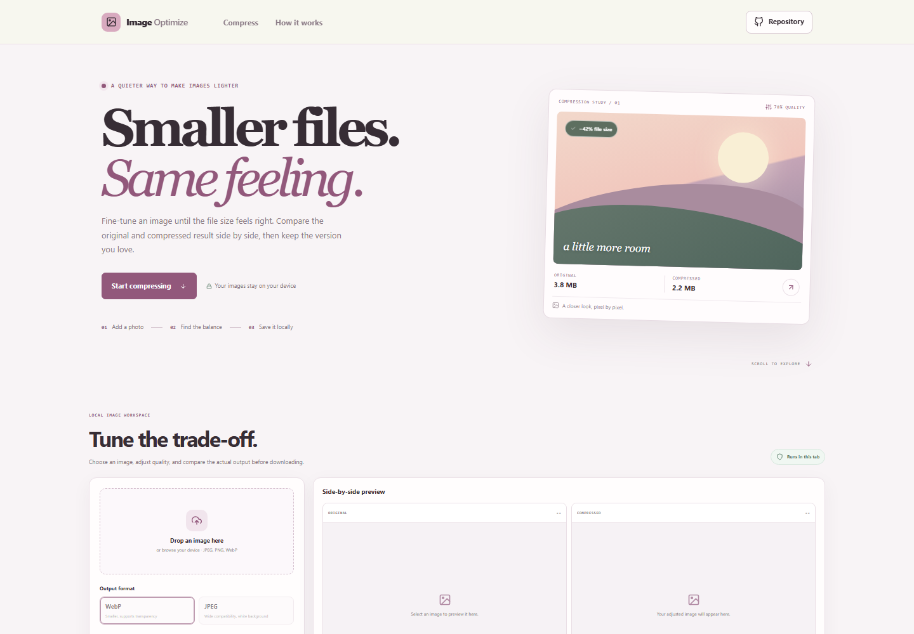



# Image Compression Preview

Compare an image with a smaller browser-encoded copy before downloading. Adjust the quality and output format, review the actual file-size change, and keep your original untouched.

**Live app:** [https://a2rp.github.io/image-compression-preview/](https://a2rp.github.io/image-compression-preview/)

## Features

- Accepts JPEG, PNG, and WebP images from a file picker or drag and drop.
- Encodes a WebP or JPEG copy in the browser with adjustable quality from 40% to 95%.
- Compares original and compressed previews side by side, with dimensions and file sizes.
- Reports the percentage and byte difference, including when the output is larger.
- Downloads a separate compressed file; the source file remains unchanged.
- Handles transparent images in WebP. JPEG output fills transparent areas with white.
- Adapts to narrow screens and supports keyboard navigation and reduced-motion preferences.

## Use the tool

1. Select an image or drop one into the upload area.
2. Choose WebP for smaller files and transparency, or JPEG for broad compatibility.
3. Adjust the quality until the size and preview look right.
4. Select Download compressed image to save a copy.

The displayed result is the actual browser-encoded output. Compression does not guarantee a smaller file; the preview reports the difference either way.

## Privacy and limits

The image is decoded and encoded locally in the current browser tab. This project does not upload images or store them in an account. The only persistent output is the file you choose to download.

Source files are limited to 20 MB. Images may be up to 8,192 pixels on each side and 25 megapixels total to avoid oversized canvas allocations. Very large images can still exceed browser or device memory; use a smaller image if the browser cannot process it. WebP export depends on browser support. JPEG output does not retain transparency.

## Development

Requirements: Node.js and npm.

    npm install
    npm run dev

Run the checks and production build:

    npm test
    npm run lint
    npm run build

Publish the build to GitHub Pages:

    npm run deploy

## Future improvements

- Add a before-and-after slider for detailed visual comparisons.
- Offer optional resize dimensions and image metadata removal.
- Support more output formats where the browser provides reliable encoding.

## Links

- Portfolio: [https://www.ashishranjan.net](https://www.ashishranjan.net)
- GitHub: [https://github.com/a2rp](https://github.com/a2rp)
- CodePen: [https://codepen.io/ash1198](https://codepen.io/ash1198)
- LinkedIn: [https://www.linkedin.com/in/aashishranjan](https://www.linkedin.com/in/aashishranjan)
- Facebook: [https://www.facebook.com/theash.ashish/](https://www.facebook.com/theash.ashish/)
- YouTube: [https://www.youtube.com/@ashishranjan-ashz?sub_confirmation=1](https://www.youtube.com/@ashishranjan-ashz?sub_confirmation=1)
- Email: [mailto:ash.ranjan09@gmail.com](mailto:ash.ranjan09@gmail.com)

## Support

- Support: [https://a2rp-donation-page.netlify.app/](https://a2rp-donation-page.netlify.app/)
- Buy Me a Coffee: [https://buymeacoffee.com/ashishranjan](https://buymeacoffee.com/ashishranjan)
- Patreon: [https://www.patreon.com/ashishranjan](https://www.patreon.com/ashishranjan)
